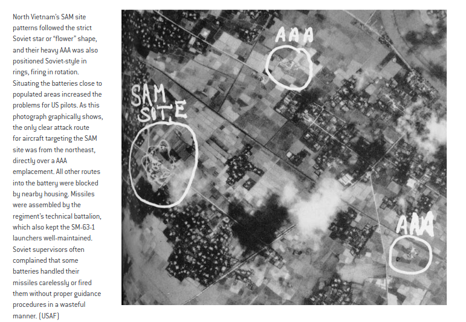

# Packing and Unpacking MIZ Files

See [the top-level README](../../README.md#changing-a-miz-file) for instructions on packing and unpacking MIZ files.

# Changing Player Aircraft

1. Pack the MIZ file and open it in the DCS Mission Editor.
1. Edit the Dynamic Templates at Krymsk airfield. Make sure the skill level is set to `Client`. Follow existing group and unit naming conventions.
1. Save changes in the Mission Editor.
1. Unpack the MIZ file.
1. Edit both `settings\payloadlimits.cfg` and `settings\ui.cfg` as required.

# Changing Hostile Aircraft

1. Pack the MIZ file and open it in the DCS Mission Editor.
1. Edit the enemy air units at Tbilisi-Lochini airfield. Make sure these are set to Late Activation. Follow existing group and unit naming conventions.
1. Save changes in the Mission Editor.
1. Unpack the MIZ file.
1. Edit `scripts/A2A.lua`, changing the content of the `airbases` table as required. Follow existing code conventions.

# Adding New Templates

## File Structure

A template consists of two files: a DCT file, which contains metadata about the template, and an STM file, which is a DCS Mission Editor Static Template which places units and statics into the game world. The DCT file and STM file have to be placed next to each other within a region folder. They can be at the top level of the region folder or nested inside subfolders, as long as they have the name filename (besides the extension) and are next to each other.

### DCT File

DCT files are documented [here](https://jtoppins.github.io/dct/designer.html#dct-example) but we only use a subset of the functionality. Here is what you need:

```lua
exclusion = "STRIKE-Senaki-1"
name = "STRIKE-Senaki-1-1"
coaltion = "red"
objtype = "ground"
intel = 5
priority = 50
cost = 60
desc = [[Template description shown in-game.
Can be split along multiple lines.

You can have blank lines, too.]]
```

- `exclusion` should be set to `TEMPLATETYPE-RegionName-TemplateID`. If multiple templates with the same `exclusion` are defined in code, DCT will select one of them randomly to use. This slightly randomizes the campaign, adding a lot of replay value and unpredictability.
- `name` should be set to `TEMPLATETYPE-RegionName-TemplateID-VariantID`.
- `coalition` should always be set to `red`.
- `objtype` should be one of the following.
    - `ground`
    - `ewr` (SEAD only)
    - `sam` (SEAD only)
    - `ship` (Antiship only)
- `intel` is a value in the range 0-5. Higher values will provide more accurate coordinates to the player. Set this to `1` for search and destroy missions, `3` for general ground attack missions, and `5` for strike missions where the target location is well-known.
- `priority` is a relative value that determines the order missions are assigned within a region. Lower values are assigned first. Use the range 1-100, with lower values being generally closer to the player's base on the region graph.
- `cost` is the number of enemy tickets depleted when the template is completed. See [Ticket Costs](#ticket-costs) for guidance.
- `desc` is the template description shown in-game.

### STM File

STM files are Static Templates, which are created and edited in the DCS Mission Editor. Note the groups and units in the STM need to follow [name conventions](#naming-conventions) and [death goal specifications](#death-goals).

## General Notes

### Naming Conventions

Templates should be named and group and unit names prefixed according to the pattern `TEMPLATETYPE-RegionName-TemplateID-VariantID` unless otherwise stated. This makes it easy to identify units in TacView when troubleshooting.
  - Example: `CAS-KashuriGori-3-2` is a CAS template and the second variant of the third template in the Kashuri-Gori region. Groups and united within the template should be prefixed with `CAS-KashuriGori-3-2`, e.g. a group might be named `CAS-KashuriGori-3-2 primary damaged`, and a unit might be named `CAS-KashuriGori-3-2-1`.

### Death Goals

Understand how [death goal specifications](https://jtoppins.github.io/dct/designer.html#death-goal-specification-goalspec) work and bias towards using death goals less than the default 90% threshold. For most templates, consider the template completed if the player heavily damaged key targets.

For completeness the death goal keywords are reproduced here:

- `PRIMARY`: Statics and groups that contain the word "primary" in their name are counted towards mission completion, and other units are not counted. (If no groups contain the word "primary", all groups are counted.)

- `UNDAMAGED`: Entity is considered completed when it has taken 10% damage (90% health remaining) or is destroyed.
- `DAMAGED`: Entity is considered completed when it has taken 45% damage (55% health remaining) or is destroyed.
- `INCAPACITATED`: Entity is considered completed when it has taken 75% damage (25% health remaining) or is destroyed.
- `DESTROYED`: Entity is considered completed when it has taken 90% damage (10% health remaining) or is destroyed.

Examples:

  - BAI template to destroy an artillery battery defended by AAA guns. Put the artillery guns in a group named "BAI-RegionName-N-N primary destroyed". Put the AAA in a group named "BAI-RegionName-N-N AAA". The template is considered complete if the overall health of the artillery guns is less than 10%, even if the AAA is still alive.
  - CAS template to engage mechanized infantry. Put the IFVs in a group named "CAS-RegionName-N-N primary incapacitated". Put the infantry in a group named "CAS-RegionName-N-N infantry". The template is considered complete if the IFVs are heavily damaged, even if the infantry are still alive.
  - Strike template to destroy a checkpoint. Name the largest static objects in the checkpoint "Strike-RegionName-N-N primary damaged N". The template is considered complete if the checkpoint takes partial damage.

### Unit Lists

Reference the provided [faction unit lists](unit-lists.md) and conform to them whe designing templates. This helps players consistently identify units, and also reduces the number of units that need to be loaded into the game which improves performance.

Do not use MANPADS for short range air defense. Instead use the SA-9 Strela vehicle. It's easier to see, dodge and destroy than an Igladude, so it's more fun to fight.

### Ticket Costs

Remember to configure the `cost` value for each template other than SEAD. Suggested values: 

- Easy: `30`
  - Threats: Small arms only
  - Template provides accurate coordinates
  - Can be completed by one aircraft in one sortie
- Medium: `60`
  - Threats may include some AAA, SA-8 or SA-9
  - Template might require searching for targets over an area
  - Can be completed by 1-2 aircraft in one sortie
- Hard: `120`
  - Threats may include heavy AAA or multiple SA-8s/SA-9s
  - Likely requires multiple sorties or 3+ aircraft

SEAD templates should not set a `cost` value; the reward is the elimination of the SAM site and degradation of the air defense network.

### Template Descriptions

I am a personal stickler for style and grammar and will likely edit your mission descriptions for consistent style. Don't spend a ton of time on them, just make sure the essential information is there and I'll rewrite them if needed.

## SEAD (Suppression of Enemy Air Defenses)

Requirements for acceptable SEAD templates:

SAM sites must have at least three variants, each in a different location, configured with the [`exclusion`](https://jtoppins.github.io/dct/designer.html#exclusion) value set to `RegionName-TemplateID`. This inhibits players from memorizing the exact location of each site.

Groups must be named and unit names prefixed according to one of the following patterns. This makes the radars work with the Air Interception script, and makes it easy to identify units in TacView when troubleshooting.
  - `SAM-RegionName-TemplateID-VariantID` for SAM sites, e.g. `SAM-Gudauta-2-3` is the third variant of the second SEAD template in Gudauta.
  - `EWR-RegionName-TemplateID-VariantID` for EWR sites, e.g. `EWR-Senaki-1-1` is the first variant of the first SEAD template in Senaki. (If there is only one variant use `-1`)

Place SAM sites in open areas away from structures and facilities. This improves authenticity- SAM launchers in real life might "cook off" and damage things nearby.

Place SAM sites in a six-pointed flower arrangement as they may have been placed in earlier parts of the Vietnam War. This makes them easier to spot by eye. [DCS Web Editor](https://dcs-web-editor.vercel.app/editor) has some good cloud templates for these arrangements.

SAM sites must be defended by SHORAD. Include a minimum of 2-3x AAA batteries along the most likely low-level approaches. These AAA sites might be as far as a mile away from the site. This provides a challenge for players who attempt low-level strikes.



## CAS (Close Air Support)

Requirements for acceptable CAS templates:

CAS templates should have at least two variants, each with hostile units placed in slightly different locations.

The description of the template should include a 9-line briefing using the template:

```lua
desc = [[<general briefing text>

1. <Ingress Point or "N/A">
2. <Heading or "N/A">
3. <Distance or "N/A">
4. Check mission data
5. <Target description>
6. Check mission data
7. <Description of marks or "No marks">
8. <Friendly location or "No factor">
9. <Egress direction or "N/A">
Remarks: <additional notes>]]
```

\#|Description|Note
-|-|-
1|Ingress Point|In DCS this is usually "N/A"
2|Heading|If Ingress Point is "N/A", this is also "N/A"
3|Distance|If 1. is "N/A", this is also "N/A"
4|Target Elevation|We use "Check mission data", since DCT provides this information using the best format for the player's aircraft.
5|Target Description|An accurate, concise and specific description of the target. Should include visual cues to help the aircrew locate the target, such as relative location to landmarks and features.
6|Target Location|We use "Check mission data", since DCT provides this information using the best format for the player's aircraft.
7|Marks|If the target is marked with a laser, "Code XXXX". If the target is marked visually (smoke, WP, IR strobe, etc.) describe the mark. If the target is not marked, "No marks".
8|Friendly location|The direction and distance from the target of any friendlies, in meters. If there are no friendlies, "N/A".
9|Egress|Recommended egress direction. Choose a direction that will keep the aircraft away from known threats and obstacles.
 |Remarks|Any additional remarks - "Troops in Contact", "Danger close", recommended ordnance, talk-on, recommended attack direction, known or possible threats, other notes.

Example:

```lua
desc = [[An FSA infantry platoon is engaging an ROI mechanized convoy. They are requesting CAS to destroy enemy IFVs.

1. N/A
2. N/A
3. N/A
4. Check mission data
5. 4 BMP-3s and estimated 12 infantry along a road running north-south, running parallel to a treeline.
6. Check mission data
7. No marks
8. Friendly infantry 400m to the east in a treeline.
9. Egress east.
Remarks: Troops in contact, danger close! Engage along the road from the south, striking the vehicles' rear armor. Request AGM or GBU-12 if available. Threats: Small arms fire.]]
```

## Strike

Strike templates that include tactical air defenses should have at least two variants, each with air defenses placed in different locations.

Do not use existing map objects for strike targets because these could change in a DCS game update. Always place new objects in the mission editor.

## BAI (Battlefield Air Interdiction)

BAI templates that require searching a large area (other than moving convoys) should have at least three variants, each with targets placed in different locations.

## Antiship

Antiship templates in which the ships do not move should have at least two variants, each with ships placed in different locations.

Consider mixing in some civilian ships to encourage players to IFF their targets.
