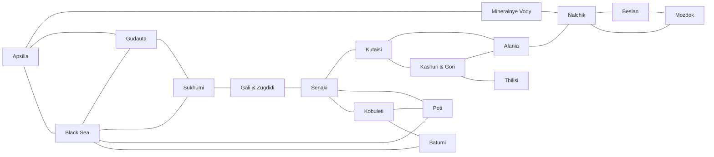

# PROJECT CALAMITY

A campaign set in the world of Project Wingman.

(Looking to add/edit mission templates? [Go here](CONTRIBUTING.md)!)

## Concept and Goals

PROJECT CALAMITY values stability, reliability, performance, focus, and longevity.

### Stability

Include only content and technology that does not change much with updates. Optimize for ease of maintenance over features.

### Reliability

Decrease the chance of DCS crashing as much as possible. Optimize for stability over features.

### Performance

Reduce the number of objects and amount of code running to the minimum amount that supports gameplay. Optimize for performance over worldbuilding/immersion.

### Focus

Target a popular and cohesive set of modules instead of trying to support every module. Optimize for gameplay over inclusion. Specifically, **only a subset of 3rd and 4th generation multirole and air superiority fighters will be playable**, and missions will be designed around their range, offensive and defensive capabilities.

### Longevity

Keep players interested in the short term with semi-randomized missions and in the medium term with sustainably developed new content delivered regularly. Content is king, so optimize for delivering both new things to do and new ways to do them.

## Lore & Context

PROJECT CALAMITY is set in the World On Fire (Project Wingman universe), over five years after the Cascadian Calamity Event. Following the major losses of the Federation’s air force, the economic impact of the Event, and the eventual success of the Cascadian rebellion, new bids for independence have been launched throughout the world. In the Caucasus, the self-proclaimed Free State of Apsilia has launched a campaign to secure their independence from the Federation-supported Republic of Iberia. The FSA has negotiated support from mercenary fighter squadrons in exchange for shares in future revenues of the region’s enormous cordium mining rights; any PMC who helps the FSA succeed stands to become one of the richest militaries on this side of the world. The Federation, deeply concerned about access to increasingly critical energy infrastructure, has deployed a valuable fighter wing to the region to support the ROI.

### Factions

- **Mercenary Company (Name TBD)**

The players’ mercenary company. A well-supplied private military company operating third and fourth generation fighters. Their force includes the AV-8B, F-4E, Mirage F1, F-14A, F-14B, F-15C, F-15E, F-16C, JF-17, F/A-18C and Mirage 2000C.

- **Free State of Apsilia (FSA)**

An autonomous region seeking to secure their territory from the ROI and establish themselves as a recognized nation. Located in the real-world territory of Abkhazia. They hire the players to secure the airspace and pressure the ROI with the aim of forcing a peace settlement on their terms. Their equipment is dated and limited, but they have the advantage in territory and morale.

- **Alanian Armed Faction (AAF)**

Another resistance group acting against the ROI, especially in the real-world territory of Ossetia. They receive indirect support and assistance from the FSA to fight an asymmetric warfare campaign against the ROI. Players may sometimes fly missions in support of AAF activities in the Alania Kashuri and Gori regions.

- **Republic of Iberia (ROI)**

An associate state of the Federation located in the real-world territory of Georgia. They operate a mix of their own dated equipment (SA-2/SA-3, older armored vehicles) along with some newer equipment in key areas (SA-6, SA-8, SA-9). Their Air National Guard operates a small fleet of 3rd generation aircraft such as the MiG-21, Mirage F1 and MiG-23.

- **Pacific Federation**

A world superpower that controls vast territories in the Asia-Pacific region. They have deployed advanced fourth-generation fighters to the area including Fulcrums, Flankers and Foxhounds.

## Gameplay Design

### Structure

The scenario uses DCT for the overall structure and ground missions. DCT is a proven stable framework used by a number of servers such as Flashpoint Levant, with a large amount of example code available for reference.

The scenario uses the Caucasus map. Caucasus is stable; objects do not move in DCS updates. It is also the best performing map in DCS world.

Players spawn at one of the northwestern airbases and make sorties throughout the rest of the map. The intent is to be similar to the later stages of the Vietnam War, where the objective was not to conquer territory but rather hold on to existing territory while pressuring the OPFOR to participate in peace negotiations.

The scenario goal is to deplete the enemy tickets to zero by completing missions and destroying enemy aircraft. All missions contribute to the goal; there are no required missions.

The scenario will be persistent across restarts, which will occur whenever the in-game daylight ends.

## Restrictions

We want players to use a variety of weapons and use multiple approaches to complete missions. Most of the enemies they will fight have relatively short threat ranges. For this reason, we restrict access to the latest generation of weapons to encourage players to fight from closer distances, rather than release weapons from outside of any danger.

Players may carry up to 2x AIM-120/SD-10 or 4x AIM-54, restricted by the DCT point buy system.
Players will not have access to any GPS guided weapon, restricted by both warehouse limits and the DCT point buy system.

The restriction is not based on a specific time period or era; current generation weapons are permitted as long as they do not use GPS guidance. Historical accuracy is not a goal or constraint.

INS is unrestricted and all aircraft will have stored heading spawns.

In the narrative, this will be explained by a combination of supply shortages and Federation interference with GNSS signals.

## Templates

The initial version of the scenario will have one template type: SEAD.

Later updates will add new template types. In no particular order:

- CAS: Frontline
- CAS: Occupied structures
- Strike: Outposts
- Strike: Command nodes
- Strike: Communications equipment
- Strike: Truck depots
- Strike: Weapons factories
- Strike: Ammo dumps
- Strike: Fuel storage
- Strike: Cordium facilities (with a scripted enhanced explosion effect)
- Strike: Bridges
- Interdiction: Mechanized and motorized troop convoys
- Interdiction: Logistics convoys
- Interdiction: Checkpoints
- Interdiction: Artillery
- Interdiction: Rocket and missile launch sites
- Antiship: Supply convoys
- Antiship: Patrol boats

We will bias towards making a large number of simple templates, and updating the scenario with additional templates over time.

Certain templates, such as SEAD, CAS: Frontline, Interdiction: Artillery, and Interdiction: Rocket and missile launch sites will make use of DCT’s exclusion feature to present one of 2-3 randomized variants. This prevents players from memorizing the exact locations of units, especially air defenses and search+destroy targets.

Completion thresholds will be set to relatively low values in many cases. The players shouldn’t need to defeat every target; getting a few bombs on the target should be considered a mission success.

## Air Defense

The scenario will have a large number of SA-2 and SA-3 sites, and a smaller number of SA-5, SA-6 and EWR sites. The sites will be networked together using an IADS script. We choose these older SAMs because they can be defeated through fun gameplay such as low-level strikes or Wild Weasel tactics. 

The Air Defense network will be supplemented by SA-8 and SA-9 tactical defense systems. We choose SA-8 and SA-9 over MANPADS because 1. the older Strela missiles are more fun to evade than the Iglas in DCS and 2. the vehicles carrying the SA-8 and SA-9 are easier to spot than infantry with MANPADS. This supports fun gameplay instead of being instantly killed by something you didn't see. [Fun is not realism!](https://www.youtube.com/watch?v=MGpFEv1-mAo)

## Air Interception

The scenario uses [MOOSE AI A2A Dispatcher](https://docs.google.com/document/d/1DrqxavzEfH9dwNhKBjh3uEIOjJ5aLN_Hh9b1fBMSPjg/edit?tab=t.0#heading=h.dtz3cpfe3dl0) for enemy air interception. Enemy fighters will be spawned when the players are detected by the Air Defense network and approach within interception range.

The AI will exclusively use aircraft which are not available to the players. While it would be appropriate for the setting to have the same aircraft on both sides, most players find this confusing given the limited IFF capability we have in DCS.

## Communications

The scenario is designed to be played with SRS and SkyEye. An E-3 will be present in the scenario for datalink purposes, but will be silenced via mission editor configuration.

## Environment

Initially the scenario will use a single, partly cloudy weather preset. Later updates will add a small number of hand-chosen presets. All presets will have the ground at least partially visible from 20,000 feet, since Wild Weasel tactics require being able to see SAM launches.

Certain presets in DCS have a high performance impact or visual glitches and we will not use those presets.

The scenario will focus on daytime operations, in part because some player aircraft are not all-weather/night fighters, and in part because night and cloud cover does not inhibit AI in the same way it inhibits players.

## Carrier Operaitons

The Forrestal is present as a player carrier. It is located in the southern area of the Black Sea, and will be a closer spawn to anti-shipping objectives added later in development.

The supercarrier will not be used because it is significantly more buggy than the Forrestal.

## Other Technical Notes

Friendly NPC units will be limited to the essentials to maintain performance. Only the carrier, tankers, AWACS, and a limited number of air defense should be present. Avoid the use of decorative statics or extra ambiance.

Size kneeboards for a 1440p display to reduce VRAM usage.

Use unlimited fuel for friendly NPC aircraft as it eliminates some weird bugs related to AI tanking.

No free mods will be supported due to extremely weird crashes, issues and general instability when using any mod.

Use the Combined Joint Task Force countries in the DCS mission editor to disable historical + country limits.
